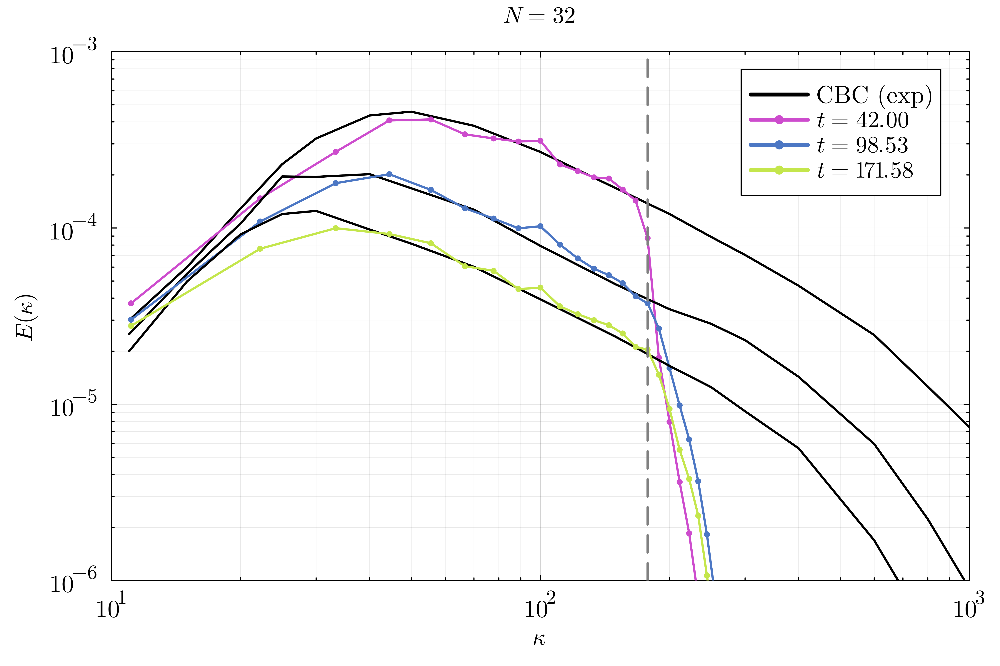
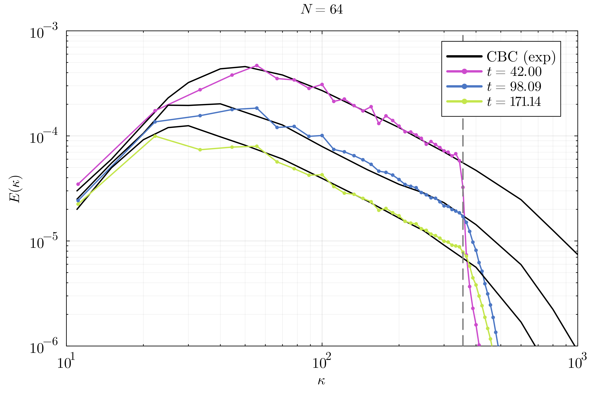

# HIT.jl: Homogeneous Isotropic Turbulence with WaterLily.jl
Simulating decaying homogeneous isotropic turbulence (HIT), made easy!

This repo uses [WaterLily.jl](https://github.com/WaterLily-jl/WaterLily.jl) as a CFD solver to simulate HIT. We use experimental data from the paper of [Comte-Bellot and Corrsin](https://doi.org/10.1017/S0022112071001599) to validate the results, and the HIT generator method from [Saad et al.](https://doi.org/10.2514/1.J055230) to create a random incompressible turbulent flow field as initial condition.

An explicit turbulence model, the [Smagorinsky-Lilly model](), is used to account for the subgrid scales. In WaterLily, we select a central difference scheme for the convective term to mitigate numerical dissipation. The numerical domain is defined as a triple-periodic box with $N$ cells per direction, resulting in $N^3$ total cells. Experimental results can be nicely matched with resolutions of $N=32$ and $N=64$, and a turbulence model constant of $C_s=0.20$ and $C_s=0.18$, respectively.

## Installation and run
First, you need to have a working Julia installation in your system, ideally with Julia version >=1.10. I recommend using [juliaup](https://github.com/JuliaLang/juliaup) to install and manage different Julia versions.

