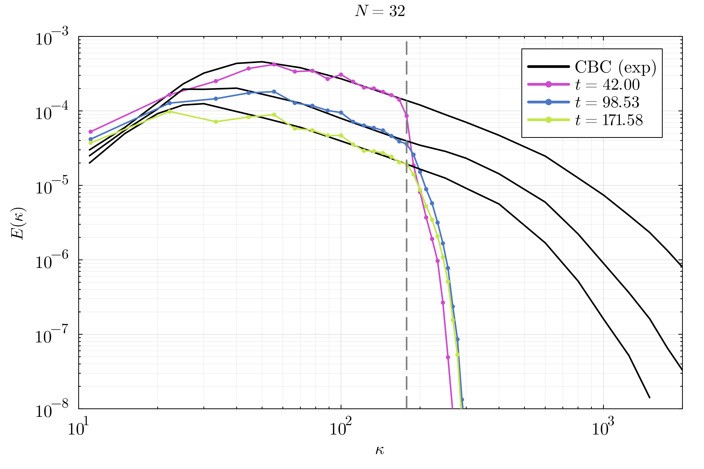

# HIT.jl: Homogeneous Isotropic Turbulence with WaterLily.jl
Simulating decaying homogeneous isotropic turbulence (HIT), made easy!

<p align="center">

</p>
<!-- <p align="center">
    <video width="360" height="360" controls=0 preload="true" autoplay="autoplay">
        <source src="https://surfdrive.surf.nl/files/index.php/s/bNtEg64b8JrWWdV/download" type="video/mp4">
    </video>
</p> -->


This repo uses [WaterLily.jl](https://github.com/WaterLily-jl/WaterLily.jl) as a CFD solver to simulate HIT. We use experimental data from the paper of [Comte-Bellot and Corrsin](https://doi.org/10.1017/S0022112071001599) to validate the results, and the HIT generator method from [Saad et al.](https://doi.org/10.2514/1.J055230) to create a random incompressible turbulent flow field as initial condition.

An explicit turbulence model, the [Smagorinsky-Lilly model](https://en.wikipedia.org/wiki/Large_eddy_simulation#Smagorinsky%E2%80%93Lilly_model), is used to account for the sub-grid scales. In WaterLily, we select a central difference scheme for the convective term to mitigate numerical dissipation. The numerical domain is defined as a triple-periodic box with $N$ cells per direction, resulting in $N^3$ total cells. Experimental results can be nicely matched with resolutions of $N=\{32,64,128,256\}$, and a turbulence model constant of $C_s=0.17$.

<p align="center">



</p>


## Installation and run
First, you need to have a working Julia installation in your system, ideally with Julia version >=1.10. I recommend using [juliaup](https://github.com/JuliaLang/juliaup) to install and manage different Julia versions.

Once Julia is installed, download this repository and use the Julia package manager to install the dependencies. The instructions below use `git` to download the repo, but you can just download the source files as well.

```sh
git clone https://github.com/b-fg/HIT.jl && cd HIT.jl
julia --project -e 'using Pkg; Pkg.add(name="WaterLily"); Pkg.instantiate()'
```
The `instantiate` command will download and compile all the dependencies. Alternatively, you can use the package manager within the Julia REPL `julia --project` by pressing `]`, and then run the (e.g.) `instantiate` command.

Next, we do the same from the `example/` directory. Here, we will indicate that the `HIT.jl` package is installed locally as well.
```sh
cd example
julia --project -e 'using Pkg; Pkg.develop(path=".."); Pkg.add(name="WaterLily"); Pkg.instantiate()'
```

Now the [`run_hit.jl`](example/run_hit.jl) script can be simply run within the `example` directory with
```sh
julia --project run_hit.jl
```
and this should produce the above plot of the energy cascade compared to the experimental data using `N=32` cells per direction.

## Playing with the `run_hit.jl` script
- Simulations can be run in either a CPU (default) or GPU. To run on GPU, in the script we add `using CUDA` and change `T=Array` to `T=CuArray`.
- Run with the desired resolution by changing `N`.
- Choose the number of spectral modes considered in the intitial velocity vector field by modifying `modes`.
- Choose to run without/with the Smagorinsky-Lilly model by setting its constant `Cs = 0` (no explicit turbulence model), or a positive value of `Cs` for the model to be activated (and use that constant value).
- Choose the discretization scheme of the convective term to use a [central difference scheme](https://en.wikipedia.org/wiki/Central_differencing_scheme) `λ = cds` or the [QUICK](https://en.wikipedia.org/wiki/QUICK_scheme) scheme `λ = quick`.
- Visualize the flow using the `viz!` routine, which generates a 3D plot of constant vorticity magnitude structures. For example
```julia
viz!(sim, ω!; t_end=sim_time(sim)+400, isovalue=0.1, algorithm=:iso, colormap=[:green])
```
generates the 3D plot and runs the simulation for 200 convective time units. You can change the isosurface value of the vorticity magnitude with the `isovalue` parameter.
