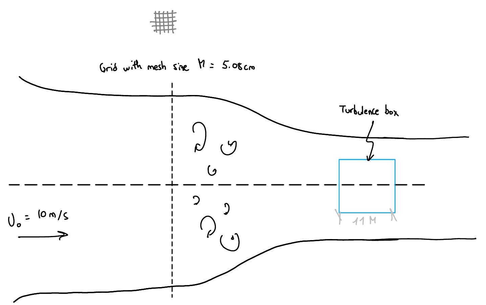
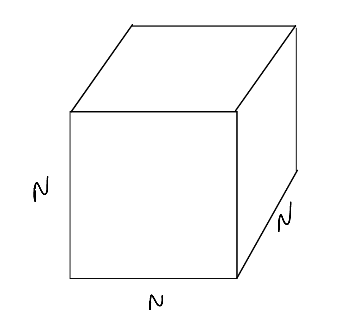

1. **Why we need turbulence modelling**
    - https://www.youtube.com/watch?v=AHBrvxodARM
    - https://www.youtube.com/watch?v=c8zKWaxohng
    - https://www.youtube.com/watch?v=hz7UjN_vYuw

1. **Validating a turbulence model with homogeneous isotropic turbulence (HIT)**
    

        <video width="360" height="360" controls=0 preload="true" autoplay="autoplay">
            <source src="https://surfdrive.surf.nl/files/index.php/s/bNtEg64b8JrWWdV/download" type="video/mp4">
        </video>
    

1. **LES formulation and modelling**

    $$
    \dfrac{\partial\boldsymbol{u}}{\partial t}+(\boldsymbol{u}\cdot\nabla)\boldsymbol{u}=-\dfrac{1}{\rho}\nabla p+\nu\nabla^2\boldsymbol{u}
    $$

    And we filter them in space using:

    $$
    \boldsymbol{u}=\boldsymbol{\tilde u} +\boldsymbol{u^{'}}; \qquad \boldsymbol{\tilde u}(\boldsymbol x,t)=\displaystyle\int_{R^3} G(\boldsymbol x-\boldsymbol x',t;\Delta x)\boldsymbol{u}(\boldsymbol x',t')\mathrm{d}\boldsymbol r=G\star\boldsymbol u
    $$

    Resulting into

    $$
    \dfrac{\partial\boldsymbol{\tilde u}}{\partial t}+(\boldsymbol{\tilde u}\cdot\nabla)\boldsymbol{\tilde u}=-\dfrac{1}{\tilde \rho}\nabla \tilde p+\nu\nabla^2\boldsymbol{\tilde u}-\nabla\cdot\boldsymbol{\tau}^{\mathrm{sgs}}
    $$

    Where the extra term $\nabla\cdot\boldsymbol{\tau}^{\mathrm{sgs}}$ captures the effect of the unresolved subgrid scale (small!) on the resolved scales. The $\boldsymbol{\tau}^{\mathrm{sgs}}$ tensor is the subgrid residual stress tensor that we need to model

    $$
    \boldsymbol{\tau}^{\mathrm{sgs}}= \widetilde{\boldsymbol{u}\otimes\boldsymbol{u}}-\tilde{\boldsymbol{u}}\otimes\tilde{\boldsymbol{u}} =
    \begin{pmatrix}
        \widetilde{u^{'} u^{'}} & \widetilde{u^{'} v^{'}} & \widetilde{u^{'} w^{'}} \\
        \widetilde{v^{'} u^{'}} & \widetilde{v^{'} v^{'}} & \widetilde{v^{'} w^{'}} \\
        \widetilde{w^{'} u^{'}} & \widetilde{w^{'} v^{'}} & \widetilde{w^{'} w^{'}}
    \end{pmatrix}
    $$

    The **Boussinesq approximation** proposes a closure such as

    $$
    \tau_{ij}-\dfrac{1}{3}\tau_{ii}\delta_{ij}=-2\nu_t\tilde{\mathbf{S}}
    $$

    where $\tilde{\mathbf{S}}=(\nabla\otimes\boldsymbol{\tilde u}+\boldsymbol{\tilde u}\otimes\nabla)/2$ is the resolved rate-of-strain tensor, and the eddy viscosity $\nu_t$ can then be simply plugged into the filtered Navier-Stokes as

    $$
    \dfrac{\partial\boldsymbol{\tilde u}}{\partial t}+(\boldsymbol{\tilde u}\cdot\nabla)\boldsymbol{\tilde u}=-\dfrac{1}{\tilde \rho}\nabla \tilde p+(\nu+\nu_t)\nabla^2\boldsymbol{\tilde u}
    $$

    The Smagorinsky-Lily model finally provides a closure for the eddy viscosity $\nu_t$

    $$
    \nu_t=(C_S\Delta)^2|\tilde{\mathbf{S}}|=(C_S\Delta)^2\sqrt{2\tilde{S}_{ij}\tilde{S}_{ij}}
    $$

1. **The HIT experiment**

    

        
    

    The turbulence spectrum of the kinetic energy, $E(\kappa,t)$ where $E=|\boldsymbol{u}|^2/2$, is measured at different convective times (CTU $=tU_0/M$): $t_0,t_1,t_2$, where $t_0$ will be our initial condition. From the experiments, we aim to match the measured energy spectrum at $t_1$ and $t_2$.

1. **The HIT simulation**

    

        
    

    We generate an initial condition for the flow velocity field so that we match the initial turbulence spectrum $E(\kappa,t_0)$. Remember that our velocity field can be represented as a finite Fourier series (ie. discrete Fourier transform, or DFT)

    $$
    \boldsymbol{\tilde u}(\boldsymbol{x},t)=\displaystyle\sum_{\boldsymbol{\kappa}}\boldsymbol{\hat{\tilde u}}(\boldsymbol{\kappa},t)e^{i\boldsymbol{\kappa}\cdot\boldsymbol{x}}=\displaystyle\sum_{\begin{subarray}{c}\boldsymbol{\kappa}\\
    \kappa<\kappa_c\end{subarray}}\boldsymbol{\hat{u}}(\boldsymbol{\kappa},t)e^{i\boldsymbol{\kappa}\cdot\boldsymbol{x}}
    $$

    where $\kappa_c$ is the cut-off wavenumber of a lowpass filter (ie. Heaviside). For a resolution of $N^3$, we have $N^3$ wavenumbers that represent the velocity field, and the wavenumber vector is

    $$
    \boldsymbol{\kappa} = \kappa_0\boldsymbol{n}
    $$

    where $\kappa_0=2\pi/L$ is the lowest wavenumber, $\kappa_\mathrm{max}=2\pi/(2L/N)=\pi/\Delta x$ is the highest wavenumber (minimum 2 points per wave), and $\boldsymbol{n}_i=-N/2,...,N/2$ is an integer vector per direction.

    The fast Fourier transform (FFT) can be used to compute the DFT of the velocity field, $\boldsymbol{\hat{u}}(\boldsymbol{\kappa},t)$, so that we can compute $E(\kappa,t)$ doing a spherical integration over each target wavenumber $\kappa=|\boldsymbol{\kappa}|$

    $$
    \begin{align*}
        \check{E}(\boldsymbol\kappa,t)=&\dfrac{1}{2}\boldsymbol{\hat{u}}(\boldsymbol{\kappa},t)\cdot\boldsymbol{\hat{u}^*}(\boldsymbol{\kappa},t)\\
    E(\kappa,t)=&\oint \check{E}(\boldsymbol\kappa,t)\mathrm{d}\mathcal{S}(\kappa)
    \end{align*}
    $$

    (Note that the turbulent kinetic energy is then $k(t)=\int_0^\infty E(\kappa,t)\mathrm{d}\kappa$, ie. integral of the full spectrum).

1. **Code implementation**
    - Turbulence generator, spectrum calculation, explicit LES model.
    - Run flow visualization at $t_0$
    - Run real-time flow visualization until $t_2$
    - Re-run with energy spectra computation and compare to experiments

1. **Playing with the script**
    - Change the resolution, $N$
    - Change the Smagorinsky constant $C_s$
    - Switch off turbulence model, what will happen?
    - Change the convective flux discretization scheme from [`cds`](https://en.wikipedia.org/wiki/Central_differencing_scheme) to [`quick`](https://en.wikipedia.org/wiki/QUICK_scheme)

1. **Creating a database to learn a new turbulence model from data**
    - Run with very fine simulation, and filter the solution
    - Compute subgrid stresses (closure term)

    [Note](https://doi.org/10.1016/j.jcp.2024.113577) on the filtering & discretization operators commutability.

1. **Train a model**

    Such that $f:\boldsymbol{\tilde u}\rightarrow\widetilde{\boldsymbol{u}^{'}\otimes\boldsymbol{u}^{'}}$